# 基于Java的编程训练系统设计与实现

#### 介绍

我开发的基于Java的编程训练系统旨在为学习编程的用户提供一个集题库资源、试卷管理、考试管理和用户交流等功能于一体的综合性训练平台。系统采用现代化的设计理念，支持高效的用户管理和丰富的题库管理功能，帮助用户提升编程能力。系统分为两种角色：管理员和用户，每个角色都有相应的功能模块，以满足不同用户的需求。

#### 技术栈

后端技术栈：Springboot+Mysql+Maven

前端技术栈：Vue+Html+Css+Javascript+ElementUI

开发工具：Idea+Vscode+Navicate

#### 系统功能介绍

（一）管理员角色  
个人中心：管理员可以在个人中心查看和修改自己的个人信息，设置系统通知方式和工作偏好等。  
用户管理：对系统中的所有用户进行全面管理，包括审核新用户注册申请、查看和编辑用户资料、冻结或解禁用户账号等，以确保用户信息的准确性和安全性。  
题库资源管理：负责收集、整理、更新和维护编程训练的题库资源。可以添加新的题目，对现有题目进行修改、删除和分类，以保证题库的丰富性和时效性。  
用户交流管理：监督和管理用户之间的交流互动，包括审核交流内容、处理违规信息、引导积极的交流氛围等，确保交流平台的健康和有序。  
试卷管理：创建、编辑和发布编程训练的试卷，设置试卷的题目组成、考试时间、分值分布等参数，以满足不同训练和考核需求。  
留言板管理：查看和处理用户在留言板上的留言，及时回复用户的问题和建议，提升用户的满意度和参与感。  
试题管理：对题库中的试题进行细致管理，包括设置试题的难度级别、知识点分类、题目描述和参考答案等，为试卷生成和训练提供基础。  
系统管理：对整个编程训练系统进行配置和维护，如设置系统参数、备份和恢复数据、管理系统日志等，保障系统的稳定运行。  
考试管理：组织和安排编程考试，包括设置考试时间、考场规则、监考人员等，并对考试结果进行统计和分析。  

（二）用户角色  
题库资源：用户可以访问丰富的题库资源，按照不同的知识点、难度级别和题型进行筛选和练习，提升编程技能。  
用户交流：在交流平台上与其他用户分享编程经验、交流学习心得、讨论技术问题，促进共同进步。  
试卷列表：查看系统提供的各种试卷，包括模拟考试卷、专项训练卷等，并根据自己的需求选择进行练习和测试。  
训练通知：接收系统发布的关于训练课程、考试安排、新题库更新等重要通知，及时了解系统的动态。  
留言反馈：用户可以在留言板上向管理员提出问题、反馈意见和建议，参与系统的优化和改进。  
个人中心：在个人中心，用户可以修改个人资料、查看自己的学习记录、成绩统计、收藏的题目等，对自己的学习情况进行全面了解。  
后台管理  
留言板管理：用户可以查看自己在留言板上的留言和回复，以及其他用户的相关交流内容。  
我的收藏管理：管理自己收藏的题目和试卷，方便随时进行复习和回顾。  

#### 系统作用

1. 提升编程技能  
为用户提供了丰富的学习资源和实践机会，通过不断的练习和测试，能够显著提升用户的编程能力和解决问题的能力。  
2. 个性化学习  
支持用户根据自己的水平和需求选择合适的题库、试卷和训练方式，实现个性化的学习路径，提高学习效果。  
3. 促进交流与合作  
用户交流平台和留言反馈功能有助于用户之间的互动和合作，形成良好的学习社区氛围，共同攻克编程难题。  
4. 高效管理与评估  
对于管理员来说，系统提供了全面的管理工具，能够方便地对用户、题库、试卷等进行管理和评估，及时了解系统的运行情况和用户的学习状况。  
5. 适应教育需求  
可应用于学校、培训机构等教育场景，满足不同教育层次和教学目标的需求，为编程教育提供有力支持。  

#### 系统功能截图

代码结构

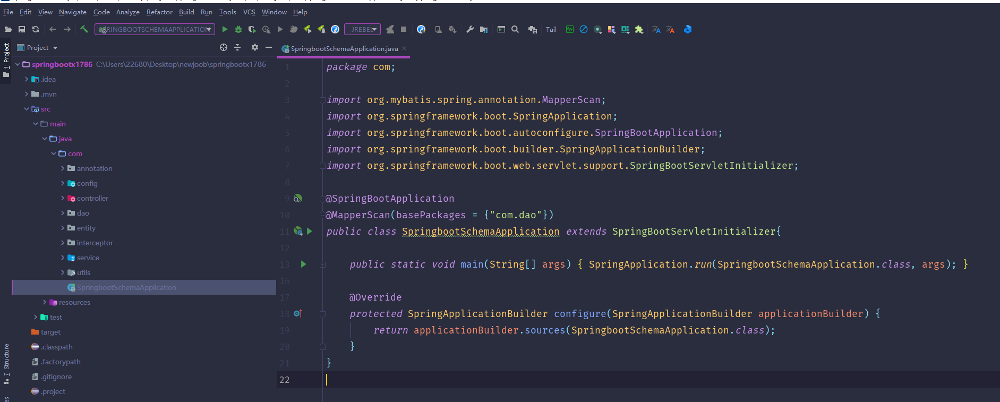

数据库表

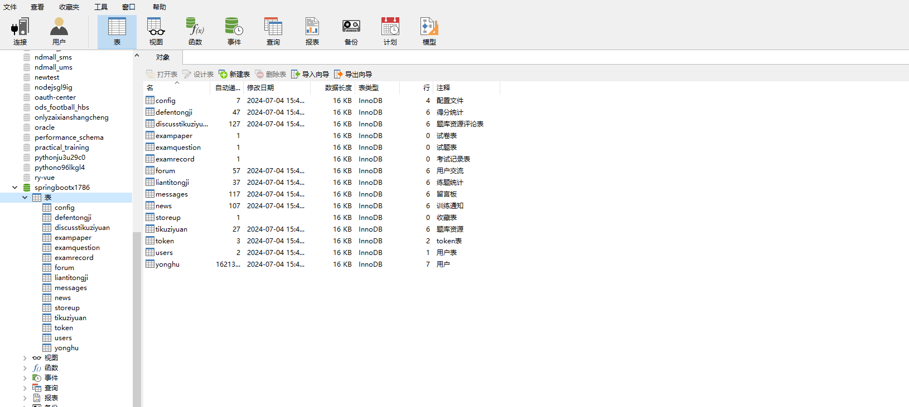

登录

用户管理

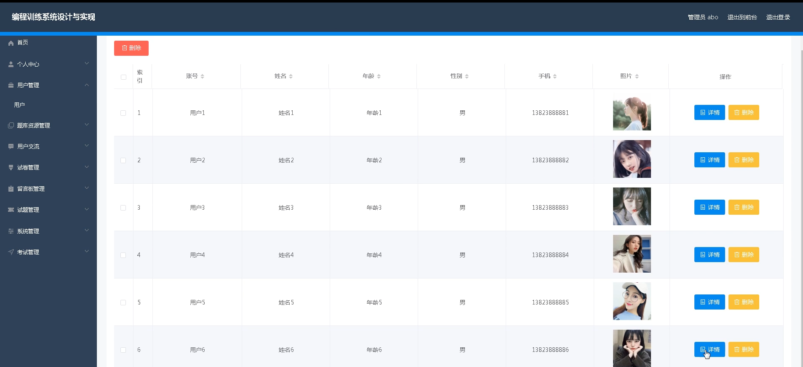

题库资源管理

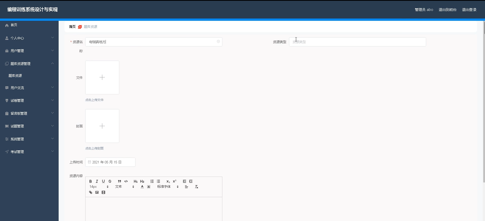

试卷管理

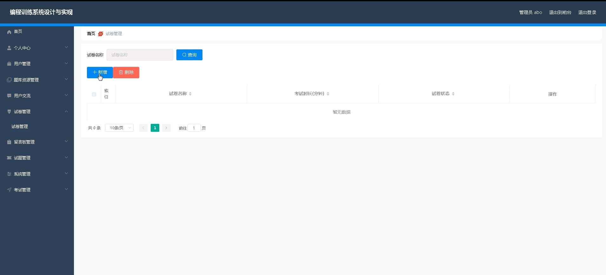

训练通知

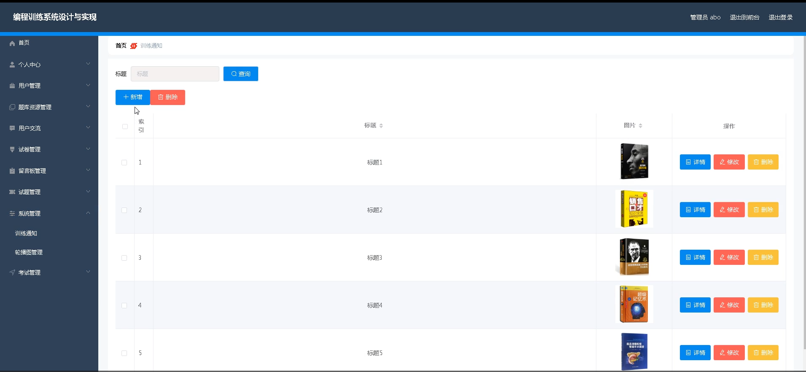

系统管理

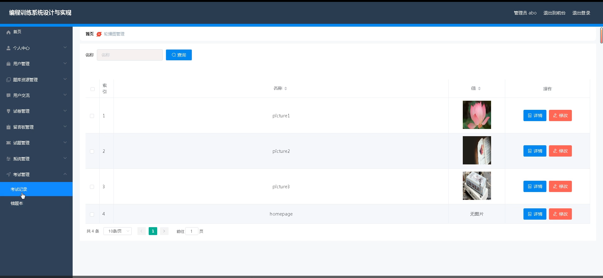

用户端个人信息

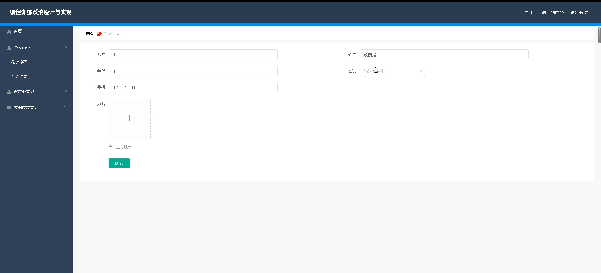

前台页面首页

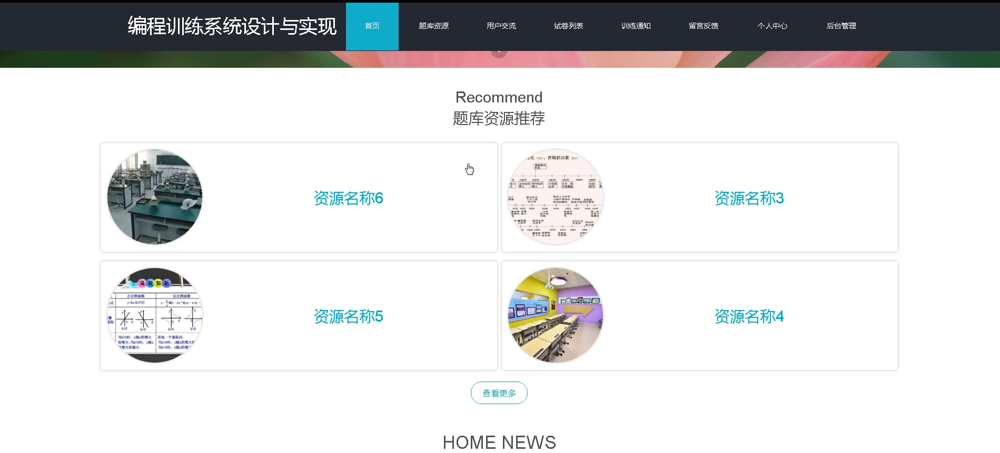

用户交流

试卷列表

留言反馈

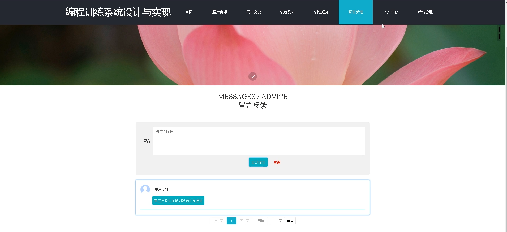

个人中心

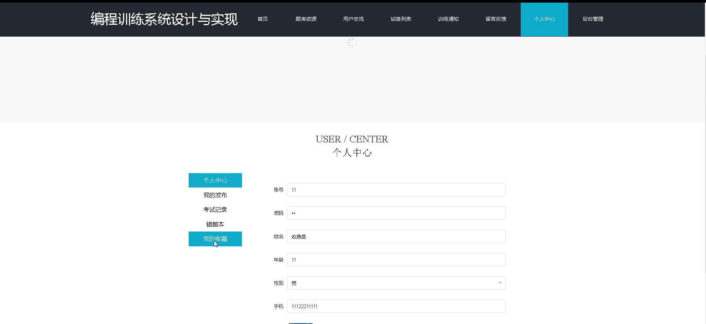

#### 总结

基于 Java 的编程训练系统通过明确的角色分工和丰富的功能模块，为编程学习者和管理者提供了一个高效、便捷、互动性强的学习和管理平台。它不仅有助于提高编程教育的质量和效率，还为培养更多优秀的编程人才奠定了基础。在未来的发展中，系统将不断优化和完善，以更好地适应不断变化的编程教育需求和技术发展趋势。

#### 使用说明

创建数据库，执行数据库脚本 修改jdbc数据库连接参数 下载安装maven依赖jar 启动idea中的springboot项目

后台地址：http://localhost:8080/springbootx1786/admin/dist/index.html

管理员  abo 密码 abo

前台地址：http://localhost:8080/springbootx1786/front/index.html